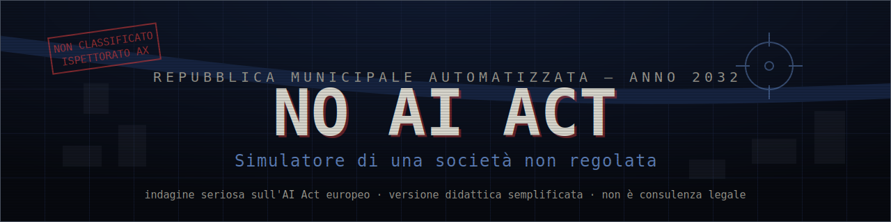

<div align="center">



[](LICENSE)
[](LICENSE)
[](#stack)
[](tests/)
[](#stato-release)
[](#lingue)

**Serious game investigativo sull'AI Act europeo · browser, zero asset esterni, salvataggio locale**

### ▶ [GIOCA ORA / PLAY NOW](https://www.no-ai-act.eu/play/)

Landing pubblica (IT/EN): `https://www.no-ai-act.eu/`
· Gioco: `https://www.no-ai-act.eu/play/`

[Come si gioca](#come-si-gioca) ·
[Uso didattico](#uso-didattico) ·
[Modalità docente](#modalità-docente) ·
[Dati e privacy](#dati-e-privacy) ·
[Game Design Document](docs/GDD.md) ·
[Licenze](#licenze)

</div>

---

> Anno 2032. In una città europea alternativa l'AI Act non è mai entrato in vigore.
> La città è efficiente, automatizzata, predittiva. Nessuno riesce più a capire,
> contestare o correggere le decisioni algoritmiche. **Tu sei l'Ispettore.**

**NO AI ACT** è un serious game investigativo per browser. Ogni caso è una
catastrofe algoritmica plausibile; risolverlo significa raccogliere i reperti,
classificare il sistema secondo la piramide del rischio dell'AI Act, imporre la
misura corretta e firmare un **rapporto ispettivo** motivato. Ogni fascicolo
chiuso sblocca la **carta norma** che — in un'altra Europa — avrebbe prevenuto
il danno.

**⚖️ Versione didattica semplificata** del Regolamento (UE) 2024/1689 (AI Act).
Questo gioco **non costituisce consulenza legale**.

| | |
|---|---|
| **Cos'è** | Serious game investigativo sull'AI Act, giocabile in browser |
| **Dove si gioca** | Landing IT/EN: <https://www.no-ai-act.eu/> · Gioco: <https://www.no-ai-act.eu/play/> (GitHub Pages) |
| **Cosa insegna** | La logica *risk-based* dell'AI Act: pratiche vietate, alto rischio, trasparenza, basso rischio — e perché la regola non "blocca" ma rende governabile |
| **A chi serve** | Studenti (14+), docenti, formazione professionale, PA, cittadinanza digitale |
| **Durata** | Da ~10–15 min (demo) a ~60–75 min (percorso avanzato) |
| **Lingue** | Italiano / English |
| **Account / dati** | Nessun account, nessun dato personale, nessun backend |

## Stato attuale del codice (v1.1.0, su `main`)

Il codice su `main` è avanti rispetto all'ultima release taggata (v1.0.0):
la v1.1 ha aggiunto l'esperienza di apprendimento strutturata (debrief delle
decisioni, rapporto di apprendimento, guida docente) e i cicli successivi hanno
rimosso i moduli esterni Tally, semplificato la schermata del titolo,
consolidato la pipeline di deploy e le guardie di test. I dettagli operativi
correnti vivono in `release.config.json` (metadati machine-readable) e nei
documenti in `docs/`.

## Novità in v1.0.0 — Prima release pubblica stabile (storico)

La v1.0.0 consolida i contenuti della v0.6 (11 casi giocabili IT/EN) in una
release pubblica stabile pensata per l'uso didattico. Nessun nuovo contenuto
di gioco: la 1.0 è una release di stabilizzazione e pubblicazione.

- **Landing pubblica IT/EN** rinnovata: nuove sezioni ("Perché esiste NO AI
  ACT", "Un serious game, non un quiz", "Prime reazioni"), FAQ ampliate,
  screenshot reale di gioco.
- **Visual bug pass** completo pre-release: archivio norme scrollabile (tutte
  le 11 norme raggiungibili), overlay coerenti in Evidence/Decision, toast e
  pannello imprevisti corretti.
- **Suite di test completa verde** (274 alla data della release); scoring, casi, norme e salvataggi invariati
  rispetto alla v0.6 (salvataggi compatibili).
- **Nessuna nuova raccolta dati**: identica impostazione privacy-by-design.

Dettagli: [`docs/RELEASE_NOTES_v1.0.0.md`](docs/RELEASE_NOTES_v1.0.0.md) ·
contenuti v0.6: [`docs/RELEASE_NOTES_v0.6.0.md`](docs/RELEASE_NOTES_v0.6.0.md).

> **No backend · No accounts · No classroom dashboard · No personal data
> collection.** Teacher mode is local debrief support. Educational simulation,
> not legal advice.

## Obiettivo didattico

- Comprendere la logica *risk-based* dell'AI Act: pratiche vietate, alto rischio,
  obblighi di trasparenza, basso rischio.
- Collegare casi concreti (scoring sociale, recruiting opaco, deepfake
  istituzionali, emotion recognition a scuola, triage predittivo, biometria
  negli spazi pubblici, credito/welfare) alle disposizioni che li governano.
- Mostrare che la regolazione non "blocca l'innovazione": la rende visibile,
  documentabile, contestabile e governabile.

**Messaggio guida:** *l'AI Act non elimina il rischio, ma lo rende visibile,
documentabile, contestabile e governabile.*

## Come si gioca

Catastrofe → fascicolo → reperti (con etichetta-fonte) → citazione di almeno 2
reperti → classificazione → misura correttiva → soggetto responsabile →
motivazione → **rapporto ispettivo** con esito → carta AI Act → conseguenza →
aggiornamento città → finale.

Il rapporto ispettivo ha quattro esiti: **CONFORME / PARZIALMENTE CONFORME /
CONTESTABILE / NON CONFORME**. Una decisione giusta ma mal motivata (reperti non
pertinenti, soggetto errato, motivazione debole) è **contestabile**, mai
conforme: non basta indovinare, bisogna *documentare*.

Quattro indicatori (0–100) reagiscono a ogni decisione: **Efficienza**,
**Controllo sociale**, **Diritti fondamentali**, **Fiducia pubblica**. Dopo 4
casi chiusi si genera il rapporto finale: *Città opaca*, *Governance fragile* o
*Innovazione governata*.

## Casi implementati

| # | Luogo | Caso | Tema AI Act | Stato |
|---|---|---|---|---|
| 1 | Municipio Centrale | La città dei punteggi | art. 5 — social scoring | ✅ giocabile |
| 2 | Agenzia del Lavoro | Il colloquio che non esiste | Allegato III — lavoro | ✅ giocabile |
| 3 | Media Center Civico | La città sintetica | art. 50 — trasparenza | ✅ giocabile |
| 4 | Scuola delle Emozioni | La classe osservata | art. 5 — emotion recognition | ✅ giocabile |
| 5 | Ospedale Predittivo | Triage invisibile | obblighi alto rischio | ✅ giocabile |
| 6 | Centro di Sorveglianza | Volti nella folla | art. 5 — biometria (finalità di contrasto) | ✅ giocabile |
| 7 | Ufficio Welfare e Servizi | Il credito civico | art. 5 / Allegato III — social scoring vs welfare/credito | ✅ giocabile |
| 8 | Sportello Civico | Lo sportello che risponde sempre | art. 50 — trasparenza, chatbot pubblico | ✅ giocabile (v0.6) |
| 9 | Ufficio Appalti | La gara opaca | alto rischio — procurement AI, governance | ✅ giocabile (v0.6) |
| 10 | Campus Adattivo | La classe profilata | Allegato III — EdTech adattiva | ✅ giocabile (v0.6) |
| 11 | Centro Modelli | Il modello tuttofare | GPAI / uso a valle del modello generale | ✅ giocabile (v0.6) |
| 12 | Commissariato di zona | Il quartiere segnato | art. 5 — polizia predittiva individuale | ✅ giocabile (2.0) |
| 13 | Ufficio Sussidi | L'algoritmo del sospetto | Allegato III — prestazioni essenziali, supervisione | ✅ giocabile (2.0) |

**13 casi giocabili** (7 base + 4 avanzati della v0.6 + 2 del pack 2.0). Il caso 7 ("Il credito
civico") è un *caso-specchio* sul confine social scoring vietato / alto rischio;
i casi 8–11 (chatbot pubblico, procurement, EdTech, GPAI) sono **casi avanzati**:
non necessariamente vietati, ma da governare in base al contesto d'uso e
all'effetto sui diritti.

## Difficoltà e percorsi

**Difficoltà selezionabili:**

- **Base** — istruzioni esplicite, suggerimento mirato dopo un errore,
  valutazione più indulgente sui vizi lievi di fondamento.
- **Standard** — rapporto completo, feedback equilibrato (consigliata per la demo).
- **Esperto** — pochi suggerimenti, feedback asciutto, severità su soggetto
  responsabile e motivazione.

**Percorsi / missioni** (nessun caso è bloccato; la mappa evidenzia i consigliati):

| Percorso | Durata | Obiettivo |
|---|---|---|
| Demo rapida | ~10–15 min | Capire la logica del rapporto ispettivo |
| Laboratorio breve | ~25–35 min | Distinguere pratica vietata, alto rischio e trasparenza |
| Percorso completo | ~45–60 min | Audit, responsabilità, misure e motivazione |
| Percorso avanzato | ~60–75 min | Casi ambigui e confini normativi (include il credito civico) |

## Uso didattico

NO AI ACT è pensato per essere usato **in autonomia** o **in aula**:

- **Pubblico**: studenti di scuola superiore e università, formazione
  professionale, funzionari PA, introduzione divulgativa all'AI Act.
- **Proiettato in classe**: il docente conduce un caso alla LIM/proiettore e
  guida la discussione (consigliato l'**EFFETTO CRT: OFF** per i proiettori).
- **Laboratorio individuale**: ogni studente gioca un percorso e poi si confronta.
- **Percorso consigliato per la prima volta**: difficoltà *Standard*,
  Laboratorio breve o Percorso completo.

La **modalità docente** aggiunge un debrief locale a fine partita con domande di
discussione (vedi sotto e [`docs/TEACHER_MODE.md`](docs/TEACHER_MODE.md)).
Guida ai playtest: [`docs/PLAYTEST_QUICK_START.md`](docs/PLAYTEST_QUICK_START.md).

## Modalità docente

La modalità docente è un **supporto locale per il debrief**. Non crea classi,
non registra studenti, non invia risultati a server.

> 🇮🇹 La modalità docente è un supporto locale per il debrief. Non crea classi,
> non registra studenti, non invia risultati a server.
>
> 🇬🇧 Teacher mode is local debrief support. It does not create classes, track
> students, or send results to a server.

A fine partita genera un debrief (esiti per caso, rilievi, norme acquisite,
indicatori, tempo, domande di discussione) consultabile a schermo, con export
`.txt`/`.json` e stampa **generati sul dispositivo**. Dettagli:
[`docs/TEACHER_MODE.md`](docs/TEACHER_MODE.md).

## Dati e privacy

> 🇮🇹 NO AI ACT è una demo pubblica accessibile tramite GitHub Pages. Il gioco
> non richiede account, non chiede nome, email, scuola o classe, e non salva
> risultati su server. La modalità docente produce solo un debrief locale.
> Eventuali export sono generati sul dispositivo dell'utente e possono essere
> condivisi manualmente. Le pagine pubbliche usano statistiche aggregate e
> privacy-friendly (Cloudflare Web Analytics, senza cookie né dati personali);
> il gioco non invia gameplay, risultati o report e la sua telemetria interna è
> disattivata di default.
>
> 🇬🇧 NO AI ACT is a public demo available through GitHub Pages. The game does
> not require an account, does not ask for names, emails, school, or class, and
> does not store results on a server. Teacher mode only produces a local
> debrief. Any exports are generated on the user's device and can be shared
> manually. The public pages use aggregate, privacy-friendly statistics
> (Cloudflare Web Analytics, no cookies or personal data); the game sends no
> gameplay, results or reports and its in-game telemetry is off by default.

Telemetria opzionale privacy-by-design (`AnalyticsSystem`): eventi di gameplay
aggregati con allowlist rigida; **niente** nomi, email, IP nel payload, free
text, cookie, fingerprinting, session replay o identificativi persistenti.
Default in produzione: **spenta**; rispetta Do Not Track. Adapter opzionali per
Plausible/Umami via variabili `VITE_*`. Dettagli e nota GDPR:
[`docs/ANALYTICS.md`](docs/ANALYTICS.md).

## Stack

| Componente | Scelta | Perché |
|---|---|---|
| Build | Vite 5 | dev server istantaneo, build statica |
| Linguaggio | TypeScript (strict) | dati di gioco tipati, refactoring sicuro |
| Engine | Phaser 3 | scene manager, tween, input e particles integrati |
| Audio | Web Audio API | sintesi procedurale, zero file e zero licenze |
| Grafica | Canvas/SVG procedurale | tutti gli asset generati a runtime |
| Persistenza | localStorage | salvataggio automatico, solo sul dispositivo |
| Test | Vitest | suite automatizzata su dati, logica, i18n, report, analytics |

Niente backend, niente account, niente asset esterni: tutto è generato
proceduralmente (vedi `ASSET_REGISTER.md`).

## Landing pubblica (SEO/GEO)

Sopra al gioco c'è un livello pubblico di presentazione, costruito come pagine
statiche dallo stesso build Vite multipagina:

- `/` — landing italiana (default), `/en/` — landing inglese, con SEO
  (canonical, hreflang it/en/x-default) e dati strutturati schema.org
  (`WebSite`, `SoftwareApplication`, `LearningResource`, `FAQPage`).
- `/play/` — il gioco Phaser (comportamento invariato). Le CTA delle landing
  passano la lingua: `/play/?lang=it` apre in italiano, `/play/?lang=en` in
  inglese; `/play/` senza query mantiene la lingua salvata.
- `/robots.txt`, `/sitemap.xml`, `/llms.txt` serviti dalla root (da `public/`),
  più i documenti AI-readable in `docs/` (`NO_AI_ACT_PROJECT_BRIEF.md`,
  `TEACHER_QUICK_START.md`, `LEGAL_DISCLAIMER.md`).
- **Nessun modulo esterno incorporato**: la versione pubblica non include form
  di feedback di terze parti e non raccoglie dati (i moduli Tally del periodo
  di playtest sono stati rimossi).

## Installazione e avvio

```bash
npm install
npm run dev        # http://localhost:5173
npm run build      # build di produzione in dist/
npm run preview    # serve la build
npm test           # suite automatizzata (Vitest)
npm run typecheck  # controllo dei tipi
```

## <a name="lingue"></a>Lingue

Localizzazione **IT/EN** completa: sistema i18n tipato (`src/game/i18n/`),
selettore nel menu, lingua persistita. Una suite di test garantisce la parità di
struttura fra i dizionari (predisposto per FR/ES).

## Accessibilità

- Contrasto AA: il testo rosso usa una variante chiara (~5.5:1 su fondo scuro).
- Font monospace ≥ 12px, valori numerici sempre accanto alle barre.
- L'informazione non è mai affidata al solo colore (etichette testuali ovunque).
- Toggle "ANIMAZIONI: RIDOTTE" (persistito): disattiva typewriter, glitch, shake e pulse.
- Toggle "EFFETTO CRT" separato (persistito): rimuove scanline/vignettatura — pensato
  per proiettori e aule.
- Tastiera: tasti numerici per le decisioni, ESC per tornare indietro.
- Audio disattivabile e persistito; click per saltare i testi.
- Limite noto: nessun supporto screen reader (rendering canvas).

## Limiti noti

- **Ottimizzato per desktop e tablet in orizzontale.** Su smartphone in portrait
  un avviso ("mobile guard") invita a ruotare il dispositivo: non è
  un'esperienza mobile-first.
- Il rendering è su **canvas Phaser**: non pienamente compatibile con screen reader.
- Contenuto giuridico in **versione didattica semplificata**: non sostituisce il
  testo del regolamento né una consulenza legale.
- **Telemetria di gioco disattivata di default** (le pagine pubbliche usano solo
  Cloudflare Web Analytics aggregato, senza cookie né dati personali); nessun
  account, nessuna dashboard classe, nessun registro studenti.
- Bundle Phaser ~388 KB gzip: accettabile per un gioco, non ottimizzato mobile-first.
- **Playtest reale ancora da completare** prima della presentazione pubblica.

## Roadmap

**✅ v1.0.0 — Prima release pubblica stabile (ultima release taggata)**
- Landing SEO/content pack IT/EN, visual bug pass pre-playtest, versioning e
  documentazione di release. Contenuti di gioco invariati rispetto alla v0.6.
  Dettagli: [`docs/RELEASE_NOTES_v1.0.0.md`](docs/RELEASE_NOTES_v1.0.0.md).

**✅ v0.6.0 — Advanced Case Pack**
- 4 casi avanzati (7 → 11): chatbot pubblico, procurement AI, piattaforma
  educativa adattiva, GPAI — casi più ambigui da governare per contesto d'uso.
- Nuovo percorso "Casi avanzati", glossario ampliato, learning card aggiornate,
  fascicolo città esteso. Nessun nuovo backend/account; salvataggi v0.5 compatibili.
  Dettagli: [`docs/RELEASE_NOTES_v0.6.0.md`](docs/RELEASE_NOTES_v0.6.0.md) ·
  [`docs/V0.6_DESIGN_NOTES.md`](docs/V0.6_DESIGN_NOTES.md).

**✅ v0.5.0 — Investigation & Learning Layer**
- Tassonomia delle fragilità decisionali, analisi della decisione nel rapporto,
  schede didattiche, reperti investigativi, fascicolo città, glossario operativo,
  export docente arricchito (locale). [`docs/RELEASE_NOTES_v0.5.0.md`](docs/RELEASE_NOTES_v0.5.0.md).

**✅ Base (v0.4.0)**
- 7 casi base, difficoltà Base/Standard/Esperto, percorsi/missioni, modalità
  docente locale, mobile guard, IT/EN, analytics privacy-by-design (off).

**🚧 In corso — verso la 2.0**
- Architettura di apprendimento (obiettivi, capitoli, auto-verifica locale,
  riflessione), accessibilità e layout compatto, pacchetto di citazione e
  metadati per ricerca/OER, consolidamento SEO IT/EN. Nessun backend, nessun
  account, nessuna raccolta dati: la 2.0 resta statica e privacy-preserving.

## <a name="stato-release"></a>Stato release

- **Versione**: v1.1.0 (ultima release taggata: v1.0.0)
- **Branch stabile**: `main` (GitHub Pages deploy attivo)
- **Distribuzione**: <https://www.no-ai-act.eu/>
- **Casi**: 11 giocabili (7 base + 4 avanzati).
- **Test / build**: suite Vitest completa + build + verifiche dist verdi in CI
  (il numero esatto di test evolve con il progetto: fonte di verità `npm test`).
- **Playtest esterno strutturato**: ancora da completare; la 1.0 è una release
  pubblica stabile, non una validazione empirica dell'efficacia didattica.

Release notes: [`docs/RELEASE_NOTES_v1.0.0.md`](docs/RELEASE_NOTES_v1.0.0.md) ·
checklist di rilascio: [`docs/RELEASE_CHECKLIST.md`](docs/RELEASE_CHECKLIST.md).

## Contribuire / testare

- Esegui `npm install && npm run dev`, gioca un percorso e segui la
  [smoke checklist](docs/SMOKE_CHECKLIST.md).
- Per organizzare un playtest con 4–5 persone:
  [`docs/PLAYTEST_QUICK_START.md`](docs/PLAYTEST_QUICK_START.md).
- Non raccogliere dati personali dei tester: usa codici anonimi (T1, T2, …).

## Licenze

- **Codice** (sistemi, generatori procedurali, UI, configurazione): **MIT** — `LICENSE`, Sezione 1.
- **Contenuti narrativi e didattici** (casi, carte norma, documentazione): **CC BY 4.0** — `LICENSE`, Sezione 2.
- **Terze parti**: il bundle distribuito include Phaser (MIT); il notice viaggia
  con la build perché `npm run build` copia `THIRD_PARTY_LICENSES.md`, `LICENSE`
  e `CREDITS.md` in `dist/` (`scripts/copy-notices.mjs`).
- Registro asset completo: `ASSET_REGISTER.md`; dettagli: `LICENSE_NOTES.md`.

## Come citare

Il repository include un file `CITATION.cff` (GitHub mostra "Cite this
repository"); formati pronti — APA, BibTeX, citazione del software con versione
esatta — sono su [no-ai-act.eu/come-citare](https://www.no-ai-act.eu/come-citare/)
(EN: [how-to-cite](https://www.no-ai-act.eu/en/how-to-cite/)). Un DOI Zenodo è
previsto con la release 2.0. Il quadro metodologico per studiare il gioco è in
`docs/RESEARCH_VALIDATION_FRAMEWORK.md` e su
[ricerca-e-metodologia](https://www.no-ai-act.eu/ricerca-e-metodologia/).

## Fonti normative

- Regolamento (UE) 2024/1689 — AI Act
- art. 5 (pratiche vietate), art. 50 (trasparenza), Allegato III (alto rischio)
- Obblighi per sistemi ad alto rischio: gestione del rischio, qualità dei dati,
  documentazione tecnica, logging, trasparenza, supervisione umana, accuratezza,
  robustezza, cybersicurezza.

I testi in gioco sono sintesi divulgative marcate "versione didattica
semplificata". La rilevanza del rischio dipende sempre dal contesto d'uso.

---

## English summary

**NO AI ACT — Simulator of an unregulated society** is a browser-based
investigative serious game about the EU AI Act (Regulation (EU) 2024/1689).
It is 2032 in an alternate European city where the AI Act never entered into
force: you are the Inspector for Algorithmic Incidents. Each of the **seven
playable cases** is a plausible algorithmic disaster — social scoring, opaque AI
recruiting, unlabeled synthetic government media, emotion recognition in schools,
predictive triage, public biometrics, civic credit/welfare scoring — to
investigate, classify under the AI Act risk pyramid and remedy with a reasoned
**inspection report**. Three difficulty modes, four mission paths, IT/EN.

No account, no backend, no personal data: every graphic and sound is generated
procedurally. Teacher mode is local debrief support only. Educational
simplification of the AI Act — not legal advice. Code: MIT · narrative and
didactic content: CC BY 4.0.

**Play now:** <https://www.no-ai-act.eu/>

```bash
npm install && npm run dev
```
